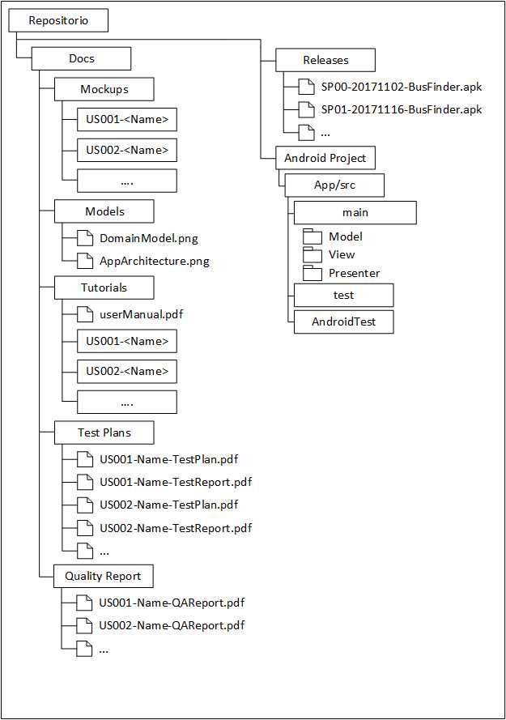
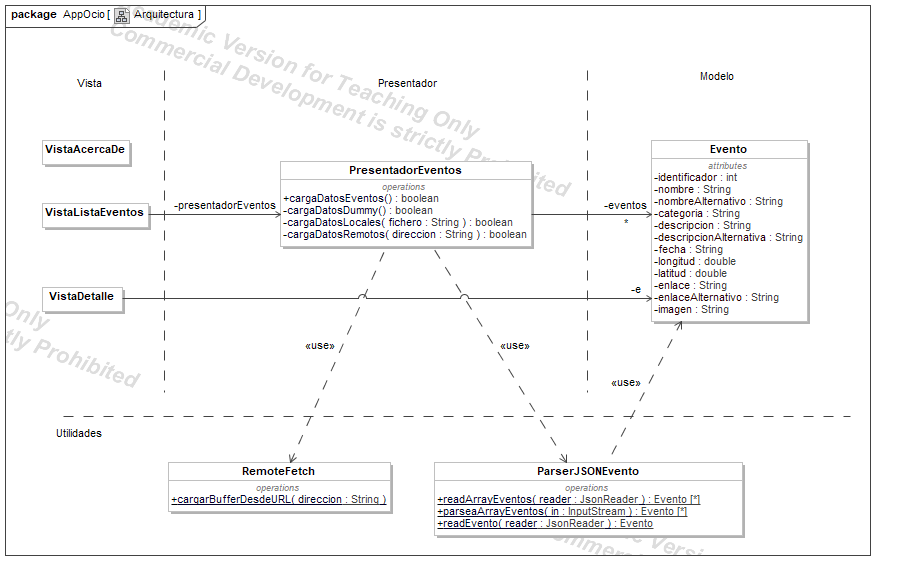

# Proyecto Base

    

Contiene un proyecto base con la estructura de directorios a utilizar en el proyecto integrado de ingeniería del software de la UC. 

Además incluye un prototipo de aplicación con algunas funcionalidades básicas que consisten en la carga de datos remotos, su visualización en formato lista e individualizada en formato vista de detalle.

Diagrama de la arquitectura Model-View-Presenter del sistema.

